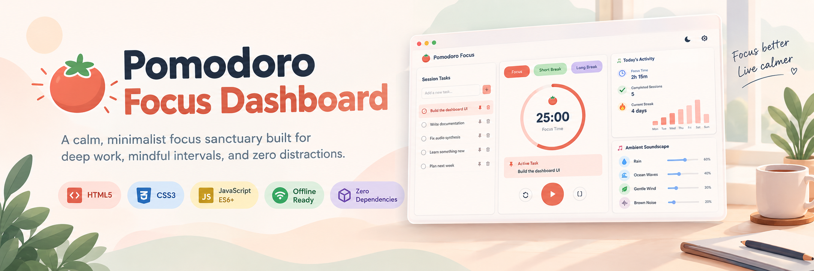
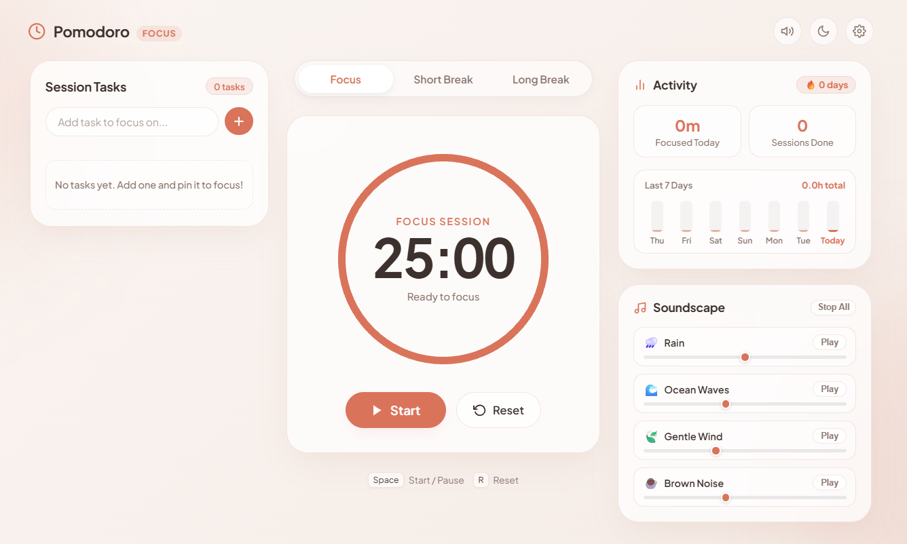
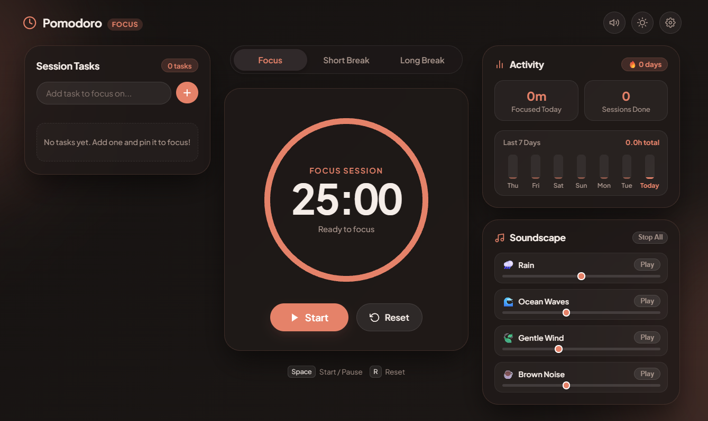

<!-- ==========================================================================
     LOGO / BANNER
     ========================================================================== -->
<p align="center">
  
</p>

# 🍅 Pomodoro Focus Dashboard

> **A calm, minimalist focus sanctuary built for deep work, mindful intervals, and zero distractions.**

<p align="left">
  <a href="LICENSE"></a>
  <a href="https://developer.mozilla.org/en-US/docs/Web/HTML"></a>
  <a href="https://developer.mozilla.org/en-US/docs/Web/CSS"></a>
  <a href="https://developer.mozilla.org/en-US/docs/Web/JavaScript"></a>
  <a href="#"></a>
  <a href="#"></a>
</p>

---

## 📖 Overview

The **Pomodoro Focus Dashboard** elevates the classic Pomodoro Technique into an all-in-one productivity desktop. Designed with glassmorphic cards, soothing pastel palettes, and a structured Bento Grid layout, it integrates countdown timekeeping, procedural ambient soundscapes, task target spotlighting, and weekly productivity tracking—all running locally with zero external dependencies.

<!-- ==========================================================================
     PRODUCT SCREENSHOTS — LIGHT & DARK MODE
     ========================================================================== -->
<table align="center" width="100%">
  <tr>
    <td width="50%" align="center"><b>☀️ Light Mode</b></td>
    <td width="50%" align="center"><b>🌙 Dark Mode</b></td>
  </tr>
  <tr>
    <td width="50%"></td>
    <td width="50%"></td>
  </tr>
</table>

---

## ✨ Key Features

- **🎯 Drift-Free Countdown Engine**: Precise timestamp-delta interval countdown that never drifts even when the browser tab is idle or backgrounded.
- **📌 Active Task Spotlight**: Pin any active task from your checklist directly into the central focus dial to keep your primary objective front-and-center.
- **🎧 Procedural Ambient Soundscapes**: 100% offline audio synthesis powered by the **Web Audio API**—procedurally generate Rain, Ocean Waves, Gentle Wind, and Brown Noise with independent volume sliders.
- **📊 Productivity Analytics & Daily Streaks**: Tracks daily focus minutes, completed pomodoros, consecutive daily streaks, and renders a dynamic **7-day mini bar chart**.
- **🌓 Light & Dark Theme Hierarchy**: Seamless theme switcher preserving equal visual weight and soothing contrast across all modes:
  - **Focus Mode**: Warm blush & terracotta coral (Light) / Deep charcoal & ember glow (Dark)
  - **Short Break Mode**: Calming sage & mint (Light) / Cool pine & jade glow (Dark)
  - **Long Break Mode**: Soft lavender & periwinkle (Light) / Deep slate & violet glow (Dark)
- **⚙️ Customizable Settings Drawer**: Configure custom minute durations for Focus, Short Break, and Long Break, plus toggle automated transitions.
- **🔒 Private & Offline First**: Zero tracking, zero external audio assets, and zero cloud lock-in. Everything persists in your browser's `localStorage`.

---

## 📐 Bento Grid Architecture

The dashboard is structured into three coordinated columns that collapse into a clean single-column layout on mobile devices:

| Column | Component | Functionality |
| :--- | :--- | :--- |
| **Left Column** | **Session Tasks** | Add, complete, delete, and **pin** tasks to spotlight your primary target. |
| **Center Column** | **Focus Stage** | Mode selectors, animated SVG progress ring, countdown readout, active task banner, and timer controls. |
| **Right Column (Top)** | **Activity Analytics** | **Today's Focus Time**, **Completed Sessions**, **Streak Badge**, and **7-Day CSS Mini Bar Chart**. |
| **Right Column (Bottom)** | **Ambient Soundscape** | Procedural synthesizers (Rain 🌧️, Waves 🌊, Wind 🍃, Brown Noise ☕) with per-channel volume mixing. |

---

## 🛠️ Tech Stack Comparison

| Category | Implementation | Benefit |
| :--- | :--- | :--- |
| **Frontend Core** | **Vanilla HTML5 & Semantic Elements** | Ultra-lightweight footprint, instant load time, high accessibility (`aria-live`, roles). |
| **Styling & Layout** | **Modern CSS3 (CSS Grid & Flexbox)** | Pure Bento Grid layout with backdrop filters, zero framework bloat (no Tailwind or Bootstrap required). |
| **State & Logic** | **Vanilla ES6+ JavaScript** | Direct DOM updates, modular event architecture, drift-free delta timing. |
| **Audio Synthesis** | **Web Audio API (`AudioContext`, Biquad Filters, LFOs)** | Synthesizes rain, tides, wind, and brown noise **locally without downloading MP3s**. |
| **Storage** | **Browser `localStorage` API** | Instant offline persistence for settings, task states, and historical analytics. |

---

## ⌨️ Keyboard Shortcuts

Speed up your focus sessions without taking your hands off the keyboard:

| Shortcut | Action | Description |
| :--- | :--- | :--- |
| <kbd>Space</kbd> | **Start / Pause** | Toggle countdown or resume active session (disabled while typing in task inputs). |
| <kbd>R</kbd> | **Reset** | Reset the timer to the beginning of the current mode interval. |

---

## 🚀 Quick Start Guide

### Prerequisites
- Any modern web browser (Google Chrome, Mozilla Firefox, Microsoft Edge, Safari, Brave).
- Optional: Python 3, Node.js, or any static file server if hosting locally.

### Option 1: Direct File Open
Simply clone or download the repository, then double-click `index.html` to open it in your browser:
```bash
git clone https://github.com/your-username/pomodoro-focus-dashboard.git
cd pomodoro-focus-dashboard
open index.html
```

### Option 2: Run via Local Python Server
To test full audio features and persistent storage across local ports:
```bash
# Start a local HTTP server
python -m http.server 8080
```
Then navigate to `http://localhost:8080/` in your browser.

### Option 3: Run via Node `npx serve`
```bash
npx serve .
```

---

## ⚙️ Configuration & Customization

Click the **Settings (gear) icon** in the top-right header to configure:
1. **Focus Duration**: Set focus intervals from **1 to 120 minutes** (Default: `25`).
2. **Short Break Duration**: Set short breaks from **1 to 60 minutes** (Default: `5`).
3. **Long Break Duration**: Set long breaks from **1 to 90 minutes** (Default: `15`).
4. **Auto-start Breaks**: Automatically trigger the break countdown when a focus session finishes.
5. **Auto-start Pomodoros**: Automatically restart the focus session once a break countdown completes.

All configuration values are saved locally to `localStorage` under the key `pomodoro_settings`.

---

## 🎧 Procedural Audio Details

The ambient soundscape engine produces calming sound textures procedurally in real-time:
- **Rain 🌧️**: Pink noise passed through a `lowpass` filter with gentle amplitude modulation.
- **Ocean Waves 🌊**: Brown noise modulated by a low-frequency oscillator (LFO at `~0.12 Hz`) mimicking tidal wash and retreat.
- **Gentle Wind 🍃**: Pink noise passed through a resonant `bandpass` filter with frequency sweeps (`~300Hz - 700Hz`).
- **Brown Noise ☕**: Smooth, deep low-frequency sound (`1/f²` integration) lowpassed at `320Hz` for deep mental flow.

---

## 📄 License

This project is licensed under the [MIT License](LICENSE) — free to use, modify, and distribute for personal and commercial projects.
