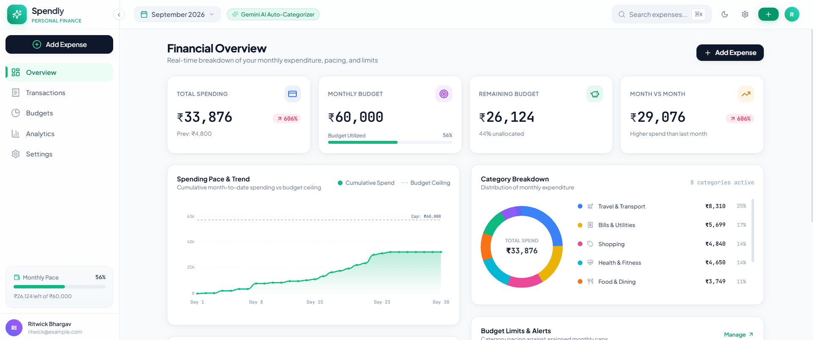
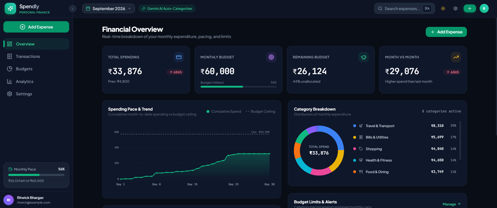

<!-- ==========================================================================
     LOGO / BANNER
     ========================================================================== -->
<p align="center">
  
</p>

# 💰 Spendly — Personal Expense & Budget Dashboard

> **Smart, privacy-first personal finance with real-time Gemini AI auto-categorization and dynamic budget pacing.**

<p align="left">
  <a href="https://github.com"></a>
  <a href="https://react.dev/"></a>
  <a href="https://www.typescriptlang.org/"></a>
  <a href="https://vitejs.dev/"></a>
  <a href="https://tailwindcss.com/"></a>
  <a href="https://ai.google.dev/"></a>
  <a href="LICENSE"></a>
</p>

---

## 📖 Overview

**Spendly** is a production-quality, responsive personal expense tracker and financial management dashboard. Designed with the elegance and precision of modern consumer fintech applications, Spendly runs entirely in your browser with **zero backend dependencies**, storing all financial records securely in **localStorage**.

Spendly features an intelligent **Dual-Engine Auto-Categorization System**: it instantly recognizes common daily purchases locally using keyword heuristics (e.g., `milk`, `flight`, `swiggy`, `train tickets`) and seamlessly falls back to **Google Gemini 2.5 Flash** for nuanced or ambiguous entries.

---

## 📸 Product Preview

<!-- ==========================================================================
     PRODUCT SCREENSHOTS — LIGHT & DARK MODE
     ========================================================================== -->
<table align="center" width="100%">
  <tr>
    <td width="50%" align="center"><b>☀️ Light Mode</b></td>
    <td width="50%" align="center"><b>🌙 Dark Mode</b></td>
  </tr>
  <tr>
    <td width="50%"></td>
    <td width="50%"></td>
  </tr>
</table>

---

## ✨ Key Features

### 📊 1. Primary Financial Overview Dashboard
* **Animated Metric Counters**: Real-time count-up metrics for **Total Spending**, **Monthly Budget**, **Remaining Budget**, and **Month-over-Month % Variance**.
* **Interactive Spending Trend Chart**: Custom SVG area chart plotting cumulative day-by-day expenditure against your **Monthly Budget Ceiling**.
* **Category Breakdown Donut Chart**: Dynamic SVG radial chart featuring slice hovering, percentage breakdowns, and direct filter navigation.
* **Budget Limits & Alerts Widget**: Instant visual warning badges indicating categories that are **Safe** (`<80%`), **Approaching Limit** (`80%–99%`), or **Over Budget** (`≥100%`).
* **Recent Transactions Feed**: Fast audit view with direct one-click modal editing.

### 🧠 2. Dual-Engine Real-Time Auto-Categorization
* **Instant Keyword Classification (Offline Engine)**: Sub-millisecond local evaluation as you type into the merchant/item description field:
  * `milk`, `bread`, `vegetables`, `eggs`, `supermarket` ➔ **Groceries**
  * `flight`, `train`, `train tickets`, `indigo`, `irctc`, `uber` ➔ **Travel**
  * `swiggy`, `zomato`, `mcdonalds`, `dinner`, `coffee` ➔ **Food & Dining**
  * `netflix`, `spotify`, `movies`, `steam`, `concert` ➔ **Entertainment**
  * `amazon`, `flipkart`, `myntra`, `zara`, `clothes` ➔ **Shopping**
  * `electricity`, `wifi`, `broadband`, `mobile recharge` ➔ **Bills & Utilities**
  * `pharmacy`, `apollo`, `doctor`, `medicines`, `gym` ➔ **Health**
  * `course`, `udemy`, `coursera`, `books`, `tuition` ➔ **Education**
* **Google Gemini 2.5 Flash Integration**: Powers automated category tagging for ambiguous purchases (e.g., *"Decathlon camping tent"*, *"AWS cloud server subscription"*) using `@google/genai`.
* **API Connection Tester**: Built-in credential verification tool in Settings to validate Gemini API connectivity.

### 💳 3. Comprehensive Transactions Ledger
* **Global Search**: Search by merchant name, amount, or custom notes.
* **Multi-Criteria Filtering**: Filter by category, payment method (**UPI**, **Credit Card**, **Debit Card**, **Cash**, **Net Banking**), and custom date ranges.
* **Flexible Sorting**: Sort chronologically (**Newest/Oldest First**), by amount (**Highest/Lowest**), or alphabetically by merchant.
* **Non-Destructive Workflows**: Complete modal editing and destructive deletion with confirmation and **Instant Undo Toast**.
* **Data Portability**: One-click **Export to CSV** for spreadsheet auditing.

### 🎯 4. Dedicated Budgets Management
* **Custom Category Caps**: Pre-configured defaults including **Food ₹8,000**, **Travel ₹15,000**, **Shopping ₹5,000**, and **Entertainment ₹3,000**.
* **Progress Metering**: Real-time spending track bars with visual threshold alerts.
* **Budget Health Overview**: Aggregated monthly pace calculation and active cap metrics.

### 📈 5. In-Depth Spending Analytics & AI Insights
* **Key Metrics**: **Average Daily Spend** calculation and **Top Spending Category** proportion.
* **Multi-Month Comparison**: Historical comparative bars tracking trajectory over recent months.
* **Day-of-Week Patterns**: Identifies spending variance between weekdays and weekends.
* **Top Merchant Rankings**: Highlights top 5 vendors by expenditure volume.
* **Gemini AI Financial Observations**: Automated advisor evaluating budget burn rate, category dominance, and money-saving recommendations.

### 📱 6. Responsive UI & Fast Navigation
* **Desktop Collapsible Sidebar**: Compact sidebar navigation featuring a floating edge toggle button that preserves brand logo visibility.
* **Mobile-First Bottom Navigation**: Accessible bottom bar with an elevated center **+** Floating Action Button (FAB).
* **Command Palette (`Ctrl+K` / `Cmd+K`)**: Instant fuzzy search across ledger records and quick navigation shortcuts.
* **Theme Support**: Seamless **Dark Mode** and **Light Mode** styling.

---

## 🛠️ Technology Stack

| Layer | Technology | Purpose |
| :--- | :--- | :--- |
| **Framework** | [React 18](https://react.dev/) | Component architecture & state management |
| **Build Tool** | [Vite 5](https://vitejs.dev/) | Lightning-fast development & production bundling |
| **Language** | [TypeScript 5](https://www.typescriptlang.org/) | End-to-end type safety & data contracts |
| **Styling** | [Tailwind CSS 3](https://tailwindcss.com/) | Modern utility-first responsive styling & dark mode |
| **Animations** | [Framer Motion](https://www.framer.com/motion/) | Polished page transitions, drawer sheets, and toasts |
| **AI Engine** | [@google/genai](https://www.npmjs.com/package/@google/genai) | Official Google SDK for Gemini 2.5 Flash categorization |
| **Icons** | [Lucide React](https://lucide.dev/) | Clean, consistent UI iconography |
| **Data Storage** | LocalStorage API | Local browser persistence with zero external server dependencies |

---

## 🚀 Getting Started

### Prerequisites

Ensure you have the following installed on your machine:
* **Node.js**: Version **`18.0.0`** or higher (Recommended: `v20.x+`)
* **npm**: Version **`9.x`** or higher (or `pnpm` / `yarn`)

### Installation

1. **Clone the repository**:
   ```bash
   git clone https://github.com/your-username/spendly.git
   cd spendly
   ```

2. **Install project dependencies**:
   ```bash
   npm install
   ```

3. **Configure Environment Variables (Optional)**:
   You can provide a Gemini API Key via a `.env` file or directly inside the app's **Settings** screen:
   ```bash
   # .env
   VITE_GEMINI_API_KEY="your_google_gemini_api_key_here"
   ```

4. **Start the development server**:
   ```bash
   npm run dev
   ```
   Open your browser and navigate to `http://localhost:5173`.

5. **Build for production**:
   ```bash
   npm run build
   ```

6. **Preview the production build**:
   ```bash
   npm run preview
   ```

---

## 📁 Project Structure

```text
spendly/
├── public/                 # Static public assets
├── src/
│   ├── components/
│   │   ├── analytics/      # AnalyticsView & AI Insights Advisor
│   │   ├── budgets/        # BudgetsView & Category Limit Modal
│   │   ├── common/         # AnimatedNumber, CategoryIcon, Toast notifications
│   │   ├── dashboard/      # Overview, MetricCards, TrendChart, DonutChart
│   │   ├── layout/         # Sidebar (collapsible), Header, MobileNav
│   │   ├── modals/         # AddExpenseModal, EditExpenseModal, DeleteConfirm, CommandPalette
│   │   └── transactions/   # TransactionsView & TransactionItem
│   ├── context/
│   │   └── ExpenseContext.tsx  # Global state provider, calculations, month filters
│   ├── data/
│   │   ├── categories.ts   # 8 core categories, color tokens & 150+ keyword rules
│   │   └── seedData.ts     # Realistic multi-month seed transactions
│   ├── services/
│   │   ├── gemini.ts       # Gemini API client & offline heuristic classifier
│   │   └── storage.ts      # LocalStorage manager, CSV & JSON backup/restore
│   ├── types/
│   │   └── expense.ts      # TypeScript interfaces and type definitions
│   ├── App.tsx             # Root application shell & routing
│   ├── index.css           # Tailwind directives & custom scrollbars
│   └── main.tsx            # React DOM entry point
├── index.html              # HTML shell with Google Fonts (Plus Jakarta Sans)
├── package.json            # Project manifest & scripts
├── tailwind.config.js      # Custom theme colors, shadows, and font families
├── tsconfig.json           # TypeScript configuration
└── vite.config.ts          # Vite build & server configuration
```

---

## 🔒 Privacy & Local Storage

* **100% Client-Side**: All transactions, custom budgets, and user settings are stored strictly in your browser's **localStorage**.
* **No Remote Telemetry**: Your financial figures are never transmitted to external analytics or private databases.
* **Direct AI Calls**: When utilizing the optional Gemini API integration, requests are dispatched directly from your browser to Google's official Gemini API endpoint using your own personal API key.
* **Full Data Ownership**: You can export your entire ledger anytime as a raw **JSON backup** or spreadsheet-ready **CSV**, or restore previous backups with zero friction.

---

## 📄 License

This project is licensed under the **MIT License** — see the [LICENSE](LICENSE) file for details.
