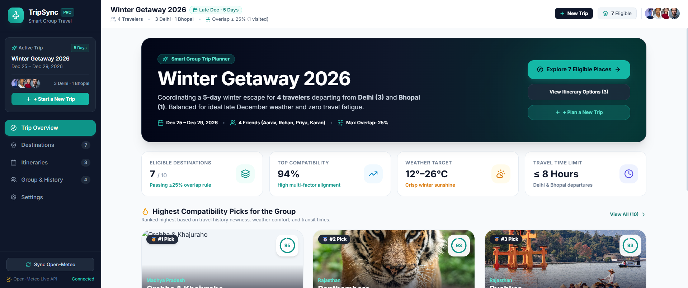

<!-- ==========================================================================
     LOGO / BANNER
     ========================================================================== -->
<p align="center">
  
</p>

# ✈️ TripSync — Smart Group Trip Planner

> **Intelligent destination discovery, multi-city transit optimization, and transparent group consensus for modern travel squads.**

<p align="left">
  <a href="https://react.dev/"></a>
  <a href="https://www.typescriptlang.org/"></a>
  <a href="https://vitejs.dev/"></a>
  <a href="https://tailwindcss.com/"></a>
  <a href="https://open-meteo.com/"></a>
  <a href="https://github.com/"></a>
  <a href="./LICENSE"></a>
</p>

---

## 📖 Overview

Planning a trip with friends often devolves into endless message threads, mismatched weather expectations, travel-time disputes, and repetitive suggestions of places people have already visited.

**TripSync** is a consumer-grade, single-page web application engineered to solve group coordination friction. It dynamically aggregates travel dates, disparate starting origins (**e.g., Delhi and Bhopal**), climatic preferences, and personal travel histories to deliver mathematically scored, consensus-driven destination recommendations.

---

## 🚀 Key Features

* **🎚️ Maximum Group Overlap Control (0% – 50%)**:
  * An interactive slider establishing how much repetition the group will tolerate:
    * **0% Overlap**: Excludes any place visited by even **1** traveler (**100% brand-new** experiences only).
    * **25% Overlap**: Permits destinations visited by at most **1** person in a 4-person squad.
    * **50% Overlap**: Permits destinations visited by up to **2** people.
  * Real-time counter reveals the count of **eligible destinations** dynamically as the slider shifts.

* **🎯 100-Point Transparent Scoring Engine**:
  * Eliminates arbitrary AI ratings by breaking down every compatibility score into **4 transparent factors**:
    * **Group Overlap & Newness (35% weight)**
    * **Weather Suitability (25% weight)**
    * **Travel Accessibility (25% weight)** (Delhi vs. Bhopal multi-city duration balance)
    * **Trip Duration Fit (15% weight)**

* **🗺️ Multi-Destination Side-by-Side Comparison**:
  * Direct matrix modal comparing **2 to 4 destinations** across live weather, origin-specific travel times, member overlap, and estimated daily budgets.

* **📅 Interactive Day-by-Day Timeline & Itineraries**:
  * Preloaded with curated pacing options:
    * **Option A — Relaxed**: *Jaisalmer · 4 Days* (Dune glamping & fort tours)
    * **Option B — Culture**: *Udaipur · 4 Days* (Lake Pichola sunset & City Palace)
    * **Option C — Multi-city**: *Jodhpur + Jaisalmer · 5 Days* (Blue City & Thar highway)
  * Features **drag-and-drop activity reordering**, modal-based event editing, cost tracking, and instant itinerary duplication.

* **👥 Group Coordination & History Heatmap**:
  * Interactive chip manager for adding or removing visited cities for every traveler.
  * Visual matrix table showing visited stamps, city counts, and overlap flags across the squad.

* **✨ Trip Planning Wizard**:
  * Three-step creation flow to set up new trips, customize multi-origin departure points, configure target weather ranges, and set transit duration tolerances.

* **🌦️ Live Weather Integration**:
  * Integrated with the **Open-Meteo REST API** with client-side caching and fallback late-December climatological data for offline reliability.

---

## 📸 Product Preview

<!-- ==========================================================================
     PRODUCT SCREENSHOT
     ========================================================================== -->
<p align="center">
  
</p>

---

## 🧮 Transparent Scoring Engine

The overall compatibility score $S \in [0, 100]$ is computed deterministically through a multi-variable objective function:

$$S = 0.35 \cdot S_{\text{newness}} + 0.25 \cdot S_{\text{weather}} + 0.25 \cdot S_{\text{access}} + 0.15 \cdot S_{\text{duration}}$$

### Factor Details

| Scoring Dimension | Weight | Primary Variables Considered |
|---|:---:|---|
| **Group Newness** | **35%** | Visited count across squad, overlap threshold penalty ($\le 50\%$) |
| **Weather Match** | **25%** | Preferred temp range ($12^\circ\text{C} - 26^\circ\text{C}$), precipitation chance, WMO code |
| **Travel Accessibility**| **25%** | Transit hours from **Delhi** (3 members) & **Bhopal** (1 member), transit limits |
| **Trip Duration Fit** | **15%** | Destination ideal stay duration ($D_{\min} - D_{\max}$) vs. planned trip days (**5 days**) |

---

## 👥 Preloaded Demo Scenario

To showcase multi-origin group dynamics, TripSync is preloaded with an authentic late-December winter trip:

* **Trip**: Late December Getaway (**5 Days**)
* **Travelers**:
  1. **Aarav Sharma** (*Delhi · Flight Preferred*) — Visited: *Delhi, Goa, Jaipur, Manali*
  2. **Rohan Verma** (*Delhi · Any Transit*) — Visited: *Goa, Jaipur*
  3. **Priya Iyer** (*Delhi · Train Preferred*) — Visited: *Manali*
  4. **Karan Patel** (*Bhopal · Flight Preferred*) — Visited: *Goa, Udaipur*
* **Baseline Dynamics**:
  * At **25% overlap limit**: **Jaisalmer** (0 visited, 100% new) and **Udaipur** (1 visited by Karan, 75% new) qualify.
  * **Jaipur** & **Manali** (2 visited) unlock only at **50% overlap**.
  * **Goa** (3 visited = 75% overlap) is excluded across standard thresholds.

---

## 🛠️ Architecture & Tech Stack

TripSync is architected as a pure client-side SPA with zero backend lock-in, persisting all state through `localStorage`.

### Technology Stack Comparison

| Role | Technology | Version | Rationale |
|---|---|---|---|
| **Core Framework** | **React** | `^18.3.1` | Declarative component hierarchy and fast rendering |
| **Language** | **TypeScript** | `^5.6.2` | Complete type safety across transit matrices and scoring |
| **Build Tool** | **Vite** | `^6.4.3` | Instant HMR and optimized production bundling |
| **Styling** | **Tailwind CSS** | `^3.4.17` | Utility-first design with custom teal/slate palette |
| **Animations** | **Framer Motion** | `^11.18.2` | Physics-based micro-interactions and modal transitions |
| **Icons** | **Lucide React** | `^0.475.0` | Clean, cohesive iconography |
| **Weather Data** | **Open-Meteo API** | `v1` | No-key weather forecasting with latitude/longitude lookup |

---

## ⚙️ Installation & Getting Started

### Prerequisites

Ensure you have the following installed on your machine:
* **Node.js**: `>= 18.0.0`
* **npm**: `>= 9.0.0`

### 1. Clone the Repository

```bash
git clone https://github.com/your-org/tripsync.git
cd tripsync
```

### 2. Install Dependencies

```bash
npm install
```

### 3. Environment Variables (Optional)

Create a `.env` file in the project root:

```env
VITE_APP_TITLE="TripSync"
VITE_DEFAULT_OVERLAP_THRESHOLD=25
VITE_OPEN_METEO_BASE_URL="https://api.open-meteo.com/v1"
```

### 4. Start Development Server

To run the local server on custom port `8080`:

```bash
npm run dev -- --port 8080 --host
```

Open your browser and navigate to:
```
http://localhost:8080/
```

### 5. Build for Production

```bash
npm run build
```

This will run TypeScript checks and output compiled assets to `/dist`:
```
dist/index.html                   1.27 kB │ gzip:   0.74 kB
dist/assets/index-*.css          40.40 kB │ gzip:   7.24 kB
dist/assets/index-*.js          415.10 kB │ gzip: 121.25 kB
```

To preview the production build locally:
```bash
npm run preview -- --port 8080
```

---

## 📂 Project Structure

```
├── .env                              # Environment variable definitions
├── index.html                        # Application entry HTML
├── package.json                      # Dependencies and npm scripts
├── tsconfig.json                     # TypeScript compiler configuration
├── vite.config.ts                    # Vite build configuration
├── tailwind.config.js                # Tailwind CSS design system tokens
│
└── src/
    ├── main.tsx                      # DOM entry point
    ├── App.tsx                       # Root container wrapping context
    ├── index.css                     # Global styles & custom scrollbars
    │
    ├── types/
    │   └── trip.ts                   # Core data models, metrics & types
    ├── data/
    │   └── initialTripData.ts        # Preloaded scenario, destinations & routes
    ├── services/
    │   ├── openMeteoService.ts       # Weather API client & fallback cache
    │   ├── travelTimeService.ts      # Multi-city transit matrix calculator
    │   └── scoringEngine.ts          # 4-factor transparent scoring algorithm
    ├── context/
    │   └── TripContext.tsx           # Global state, persistence & mutations
    │
    └── components/
        ├── common/
        │   ├── Modal.tsx             # Accessible dialog component
        │   ├── ScoreRing.tsx         # Circular SVG score badge
        │   ├── Toast.tsx             # Animated notification toasts
        │   └── CreateTripModal.tsx   # 3-step New Trip planning wizard
        ├── layout/
        │   ├── AppShell.tsx          # Responsive container shell
        │   ├── Sidebar.tsx           # Desktop compact sidebar
        │   ├── Header.tsx            # Sticky top bar with quick actions
        │   └── MobileNav.tsx         # Mobile bottom navigation bar
        ├── overview/
        │   └── TripOverview.tsx      # Dashboard, key metrics & top picks
        ├── destinations/
        │   ├── OverlapSlider.tsx     # 0% to 50% overlap control
        │   ├── FilterBar.tsx         # Search, tags & sort dropdown
        │   ├── DestinationCard.tsx   # Photo cards with score badges
        │   ├── DestinationDetailModal.tsx # Factor breakdown modal
        │   ├── CompareModal.tsx      # Multi-destination side-by-side matrix
        │   └── DestinationDiscovery.tsx # Main exploration page
        ├── itineraries/
        │   ├── ActivityEditModal.tsx # Schedule activity editor
        │   ├── DayTimeline.tsx       # Day schedule with reordering
        │   ├── ItineraryCompareModal.tsx # Option comparison
        │   └── ItinerariesView.tsx   # Itinerary manager
        └── group/
            ├── TravelerCard.tsx      # Individual traveler & visited chips
            ├── OverlapMatrix.tsx     # Squad history heatmap
            └── GroupView.tsx         # Group management view
```

---

## 🤝 Contributing

1. Fork the Project repository.
2. Create your Feature Branch (`git checkout -b feature/SmartRecommendation`).
3. Commit your Changes (`git commit -m 'feat: Add travel cost optimization'`).
4. Push to the Branch (`git push origin feature/SmartRecommendation`).
5. Open a Pull Request.

---

## 📄 License

Distributed under the **MIT License**. See `LICENSE` for more information.

---

<div align="center">
  <sub>Crafted for effortless group adventures with <b>TripSync</b>.</sub>
</div>
